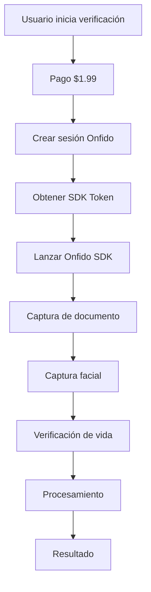

# 🔐 Integración de Onfido - ForeverUsInLove

## 📋 Configuración del Workflow

### Información del Workflow
- **Nombre**: `flutter_new`
- **ID**: `2e849672-bc5e-449a-9feb-c40ccde8b575`
- **Token de API**: `EYFA0st4yuXDVrldNshBRtj4zfIgAoAlw89BsvnZ4IE`
- **Entorno**: **LIVE (Producción)** 🚀

### Compatibilidad de Plataformas
- **Web**: 14.39.0 o posterior
- **Android**: 22.1.0 o posterior
- **iOS**: 32.1.0 o posterior
- **Smart Capture Link**: No soportado

## 🏗️ Arquitectura del Sistema

### Archivos Creados/Modificados

1. **`lib/features/verification/data/config/onfido_config.dart`**
   - Configuración centralizada de Onfido
   - Constantes para workflow, tokens, y apariencia

2. **`lib/features/verification/data/services/onfido_service.dart`**
   - Servicio principal para integración con Onfido SDK
   - Métodos para iniciar verificación y crear sesiones

3. **`lib/features/verification/presentation/pages/onfido_verification_page.dart`**
   - Actualizado para usar el servicio real de Onfido
   - Eliminada la simulación, ahora usa SDK real

4. **`lib/features/verification/presentation/pages/verification_payment_page.dart`**
   - Integrado con el servicio de Onfido
   - Crea sesiones reales después del pago

## 🔄 Flujo de Verificación



## 📱 Pasos de Verificación

1. **Selección de documento**
2. **Captura frontal del documento**
3. **Captura trasera del documento**
4. **Lectura NFC** (opcional)
5. **Captura facial**
6. **Verificación de vida** (liveness)
7. **Subida y procesamiento**

## 🎨 Personalización de Apariencia

- **Color primario**: `#34C759` (Verde de la app)
- **Color secundario**: `#28A745` (Verde más oscuro)
- **Modo oscuro**: Soportado
- **Idioma**: Inglés (US)

## 🔧 Configuración del Backend

### Endpoints Requeridos

1. **Crear sesión de verificación**
   ```
   POST /api/v1/verification/create-session
   Body: {
     "payment_transaction_id": "string",
     "user_id": "string",
     "workflow_id": "string"
   }
   ```

2. **Verificar estado de verificación**
   ```
   GET /api/v1/verification/status/{session_id}
   ```

3. **Webhook de Onfido** (opcional)
   ```
   POST /api/v1/verification/webhook
   ```

## 📦 Dependencias Requeridas

```yaml
dependencies:
  onfido_sdk: ^9.1.0  # SDK oficial de Onfido
  dio: ^5.0.0         # Para llamadas HTTP
  get_it: ^8.2.0      # Inyección de dependencias
```

### ✅ **Dependencias Instaladas**:
- ✅ `onfido_sdk: 9.1.0` - SDK oficial de Onfido
- ✅ `dio: 5.0.0` - Para llamadas HTTP
- ✅ `get_it: 8.2.0` - Inyección de dependencias

## 🚀 Próximos Pasos

### 1. ✅ Dependencias Instaladas
```bash
flutter pub add onfido_sdk dio get_it
```
**Estado**: ✅ Completado - Todas las dependencias están instaladas

### 2. Configurar Plataformas

#### Android
- Agregar permisos en `android/app/src/main/AndroidManifest.xml`
- Configurar ProGuard si es necesario

#### iOS
- Agregar permisos en `ios/Runner/Info.plist`
- Configurar App Transport Security

### 3. Implementar Backend
- Crear endpoints para sesiones de verificación
- Implementar webhooks de Onfido
- Configurar base de datos para tracking

### 4. Testing
- Probar en entorno sandbox
- Validar flujo completo
- Probar casos edge (cancelación, errores)

## 🔍 Debugging

### Logs Importantes
- SDK Token generado
- Workflow Run ID
- Resultados de verificación
- Errores de captura

### Casos de Error Comunes
1. **Token inválido**: Verificar configuración del backend
2. **Workflow no encontrado**: Verificar ID del workflow
3. **Permisos de cámara**: Verificar configuración de plataforma
4. **Red**: Verificar conectividad

## 📚 Recursos Adicionales

- [Documentación oficial de Onfido](https://documentation.onfido.com/)
- [SDK Flutter de Onfido](https://pub.dev/packages/onfido_sdk)
- [Guía de integración](https://documentation.onfido.com/sdk/flutter/)
- [Soporte técnico](https://support.onfido.com/)

## ⚠️ Notas Importantes

- **Entorno Sandbox**: Usar solo para desarrollo
- **Tokens**: No exponer en código fuente
- **Permisos**: Requeridos para cámara y almacenamiento
- **Testing**: Probar en dispositivos reales
- **Compliance**: Verificar regulaciones locales
